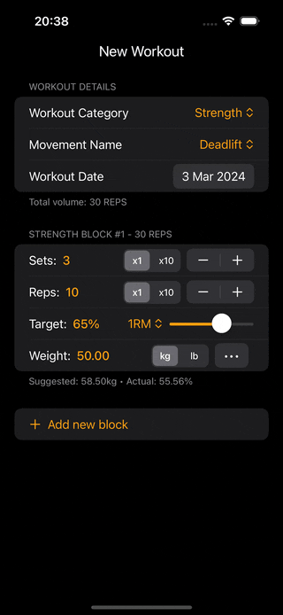

<!-- markdownlint-disable MD033 -->
<p align="center">
  <a href="https://mgcrea.github.io/react-native-swiftui">
    
  </a>
</p>
<p align="center">
  <a href="https://www.npmjs.com/package/@mgcrea/react-native-swiftui">
    
  </a>
  <a href="https://www.npmjs.com/package/@mgcrea/react-native-swiftui">
    
  </a>
  <a href="https://www.npmjs.com/package/@mgcrea/react-native-swiftui">
    
  </a>
  <a href="https://www.npmjs.com/package/@mgcrea/react-native-swiftui">
    
  </a>
  <br />
  <a href="https://github.com/mgcrea/react-native-swiftui/actions/workflows/main.yaml">
    
  </a>
  <a href="https://depfu.com/github/mgcrea/react-native-swiftui">
    
  </a>
</p>
<!-- markdownlint-enable MD037 -->

This library integrates SwiftUI components into React Native using the Fabric renderer. This project enables developers to define native iOS UI elements with SwiftUI, controlled via React Native’s JSX syntax, creating a hybrid UI where React drives a dynamic SwiftUI view hierarchy.

## Motivation

React Native excels at cross-platform development, but its UI components can sometimes lack the polish and performance of native iOS frameworks like SwiftUI. This PoC bridges that gap by:

- Leveraging SwiftUI’s declarative, high-performance UI toolkit for iOS.
- Using React Native’s Fabric renderer for modern, efficient native integration.
- Enabling a familiar JSX workflow to manage native views.

Ideal for developers seeking native iOS aesthetics and behavior within a React Native app, this project explores a hybrid paradigm for enhanced UI flexibility.

## Demo



## Features

- **Supported Components**: We plan to support as many SwiftUI components as possible.
- **Two-Way Data Binding**: Syncs state between JavaScript and SwiftUI (e.g., text input updates via `onChange`).
- **Event Support**: Handles events like `change`, `focus`, `blur`, `press` across the JS-native boundary.
- **Visual Feedback**: Disabled fields (e.g., `TextField` with `disabled={true}`) are grayed out and faded for clarity.
- **Type Safety**: TypeScript definitions for props and events, ensuring a robust developer experience.
- **Form Library Compatibility**: Works seamlessly with libraries like `react-hook-form` and `formik` via passthrough component support.

## Installation

### Prerequisites

- Node.js ≥ 18
- React Native 0.78.0+
- iOS 15.1+ (SwiftUI requirement)
- `pnpm` (package manager, version 10.5.2 recommended per `package.json`)

### Steps

Installation steps:

```bash
npm install @mgcrea/react-native-swiftui --save
# or
pnpm add @mgcrea/react-native-swiftui
# or
yarn add @mgcrea/react-native-swiftui
```

## Usage Example

### Basic Example

```tsx
import { SwiftUI } from "@mgcrea/react-native-swiftui";
import { useState, type FunctionComponent } from "react";
import { Alert, View } from "react-native";

export const BasicFormExample: FunctionComponent = () => {
  const [firstName, setFirstName] = useState("John");
  const [lastName, setLastName] = useState("Doe");
  const [birthDate, setBirthDate] = useState(new Date("2019-06-03T00:00:00Z"));
  const [gender, setGender] = useState<"Male" | "Female">("Male");

  const handleSubmit = () => {
    const data = {
      firstName,
      lastName,
      birthDate,
      gender,
    };
    Alert.alert("Submitted", JSON.stringify(data, null, 2));
  };

  return (
    <View style={{ flex: 1 }}>
      <SwiftUI style={{ flex: 1 }}>
        <SwiftUI.Text text="BasicFormExample" />
        <SwiftUI.Form>
          <SwiftUI.Section header="Personal Information">
            <SwiftUI.TextField placeholder="First name" onChange={setFirstName} text={firstName} />
            <SwiftUI.TextField placeholder="Last name" onChange={setLastName} text={lastName} />
          </SwiftUI.Section>
          <SwiftUI.Section header="Additional Details">
            <SwiftUI.Picker
              options={["Male", "Female"]}
              label="Gender"
              onChange={setGender}
              selection={gender}
            />
            <SwiftUI.DatePicker
              label="Birth date"
              selection={birthDate}
              onChange={(value) => setBirthDate(value)}
              displayedComponents="date"
            />
          </SwiftUI.Section>
          <SwiftUI.Button title="Submit" onPress={handleSubmit} />
        </SwiftUI.Form>
      </SwiftUI>
    </View>
  );
};
```

## Supported Components

Below is a list of components currently supported by `@mgcrea/react-native-swiftui`. These components leverage SwiftUI's native iOS capabilities while being controlled via React Native's JSX syntax.

| Component    | Description                                 | Key Props                                                                  | Notes                                                                                   |
| ------------ | ------------------------------------------- | -------------------------------------------------------------------------- | --------------------------------------------------------------------------------------- |
| `Button`     | A clickable button with customizable styles | `title`, `buttonStyle`, `disabled`, `style`, `onPress`                     | Supports styles like `default`, `plain`, `bordered`, etc.                               |
| `DatePicker` | A date/time selection picker                | `selection`, `label`, `datePickerStyle`, `displayedComponents`, `onChange` | Options include `compact`, `wheel`, etc.; supports `date`, `hourAndMinute` components   |
| `Form`       | A container for grouping form elements      | Children (nested components)                                               | No specific props; acts as a layout container                                           |
| `Group`      | A logical grouping of views                 | Children (nested components)                                               | No specific props; used for hierarchy organization                                      |
| `HStack`     | Horizontal stack layout                     | `alignment`, `spacing`, `style`, Children                                  | Alignments: `top`, `center`, `bottom`, etc.                                             |
| `Image`      | Displays an image (named, system, or local) | `name`, `source`, `sourceUri`, `resizeMode`, `style`                       | Supports `system:` prefix for SF Symbols, asset names, and bundled assets via `require` |
| `Picker`     | A dropdown or segmented selection           | `options`, `selection`, `label`, `pickerStyle`, `onChange`                 | Styles: `menu`, `segmented`, `wheel`, etc.                                              |
| `Rectangle`  | A simple rectangular shape                  | `style`                                                                    | Used for basic shapes with customizable styling                                         |
| `Section`    | A collapsible section within a form         | `header`, `footer`, `isCollapsed`, Children                                | Useful for organizing form content                                                      |
| `Sheet`      | A modal sheet presentation                  | `isPresented`, `detents`, `onDismiss`, Children                            | Detents: `medium`, `large`, or custom values                                            |
| `Slider`     | A continuous value slider                   | `value`, `minimum`, `maximum`, `step`, `label`, `onChange`                 | Adjustable range with step increments                                                   |
| `Spacer`     | A flexible space filler                     | `minLength`                                                                | Expands to fill available space                                                         |
| `Stepper`    | An increment/decrement control              | `value`, `label`, `minimum`, `maximum`, `step`, `onChange`                 | For numeric adjustments                                                                 |
| `Text`       | Displays static text                        | `text`, `alignment`, `style`                                               | Alignments: `leading`, `center`, `trailing`                                             |
| `TextField`  | An editable text input                      | `text`, `label`, `placeholder`, `keyboardType`, `onChange`                 | Supports various keyboard types and text content types                                  |
| `Toggle`     | A switch for boolean values                 | `isOn`, `label`, `onChange`                                                | Simple on/off control                                                                   |
| `VStack`     | Vertical stack layout                       | `alignment`, `spacing`, `style`, Children                                  | Alignments: `leading`, `center`, `trailing`                                             |
| `ZStack`     | Overlapping stack layout                    | `alignment`, `style`, Children                                             | Alignments: `topLeading`, `center`, `bottomTrailing`, etc.                              |

## Contribute

We welcome contributions! If you have ideas for new components, optimizations, or bug fixes, please fork the repository and submit a pull request. We also encourage you to open issues for any bugs or feature requests.

### Prerequisites

- **Xcode**: Ensure you have Xcode installed for iOS development.
- **CocoaPods**: Install CocoaPods if you haven't already. You can do this by running:
  ```bash
  sudo gem install cocoapods
  ```
- **pnpm**: Install `pnpm` globally if you haven't already:
  ```bash
  npm install --global corepack@latest
  corepack enable pnpm
  ```

### Example Project

To run the example project, follow these steps:

```bash
git clone https://github.com/mgcrea/react-native-swiftui.git
cd react-native-swiftui

pnpm install # install Node.js dependencies
npm run codegen:ios # generate codegen files

bundle install # setup Ruby environment
npm run install:ios # install project native dependencies

cd example
pnpm install # install example Node.js dependencies

npm run ios # run the example project
```

If the build fails, you should try to build from XCode directly using `npm run open:ios` and then run the app from XCode.

### Notes

- **Props**: Most components accept a `style` prop for layout and appearance customization (e.g., `width`, `height`, `backgroundColor`).
- **Events**: Components like `Button`, `TextField`, and `Picker` support event handlers (e.g., `onPress`, `onChange`) for interactivity.
- **Children**: Layout components (`Form`, `HStack`, `VStack`, etc.) accept nested components as children.
- **Image Sources**: The `Image` component supports:
  - Named assets from `Assets.xcassets` (e.g., `name="logo"`).
  - System images with a `system:` prefix (e.g., `name="system:star.fill"`).
  - Local bundled assets via `source={require('../path/to/image.png')}`.

## How It Works

1. **Component-Level Tree Building**: Each `SwiftUI.*` component (e.g., `<SwiftUI.TextField>`) registers itself with a `viewTree` during React’s render phase, using a context-based system.
2. **Native Rendering**: The aggregated `viewTree` is serialized as JSON and sent to iOS, where SwiftUI renders it via Fabric’s native bridge. Components use a unified `Decodable` approach for prop initialization.
3. **Two-Way Binding**: State updates (e.g., text input) sync between React and SwiftUI via event handlers, with props merged efficiently on updates.
4. **Event Handling**: Native events (e.g., `onChange`, `onPress`) are bubbled back to JavaScript through a custom event system.

### Architecture

- **React Native (JS/TS)**:
  - Defines UI structure in JSX.
  - Uses `SwiftUIContext` for event handling and node registration.
  - Uses `SwiftUIParentContext` to maintain parent-child hierarchy.
  - Components register their `ViewTreeNode` dynamically during render.
- **Fabric**: Facilitates communication between JavaScript and native code.
- **SwiftUI (iOS)**:
  - Renders the UI using native components (e.g., `TextField`, `Button`) based on the `viewTree`.
  - `Props` classes (e.g., `PickerProps`) conform to `Decodable` for initialization and use `merge(from:)` for updates, unifying prop handling.
- **Bridge**: Custom Objective-C++ and Swift files (e.g., `RCTSwiftUIRootView.mm`, `SwiftUIRootView.swift`) manage data flow and event propagation.

### Key Implementation Details

- **Dynamic `viewTree` Generation**: Components register themselves via `SwiftUIContext.registerNode`, with hierarchy tracked using `SwiftUIParentContext`. This supports passthrough components (e.g., `<Controller />` from `react-hook-form`) without explicit prop forwarding.
- **Context System**:
  - `SwiftUIContext`: Manages event handlers and the `nodeRegistry`.
  - `SwiftUIParentContext`: Provides `parentId` to child components via `ParentIdProvider`, ensuring correct tree structure.
- **Prop Initialization**: Native `Props` classes use `Decodable` to initialize from JSON, reducing redundancy and ensuring consistency across `viewTree` and Fabric flows.
- **Rendering**: Components return `null` in JSX, as the UI is fully handled by SwiftUI on the native side.

### Notes

- **State Management**: The library is agnostic to state management. Use React state, `react-hook-form`, `formik`, or any other library to manage form values.
- **Events**: Pass callbacks like `onChange` or `onPress` to handle native events in JavaScript.
- **Disabled Fields**: Set `disabled={true}` on components like `TextField` to disable interaction, with visual feedback (grayed-out text and reduced opacity).

## Contributing

Feel free to fork the repo, experiment with new components, or suggest optimizations! Open issues or PRs on [GitHub](https://github.com/mgcrea/react-native-swiftui).

```

```
